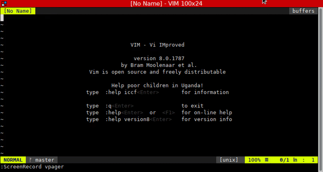

# Vpager plugin
> A Vim plugin to copy output of vims terminal to a new buffer.

This plugin contains a shell implementation of a pager, that will take the input and send it to a vim plugin. The Vim plugin processes the input and stores it in a new window.

See also the following screencast:



### Installation
Use the plugin manager of your choice.

### Usage
This makes use of Vims built in terminal and the provided terminal API. You need at least Vim version [8.0.1647](https://github.com/vim/vim/releases/tag/v8.0.1647)

Use the provided `vpager.sh` script and pipe input into it. I suggest to put it into your $PATH, to be easily available.

The script supports the following options:

#### Ex commands:
```shell
NAME

    This script vpager can be used as pager from inside Vims built-in
    terminal. The output will be copied to a new buffer in Vim.

SYNOPSIS
    vpager [-n -C option]
    vpager [-h|-v]

    -v  display version
    -h  display help
    -C  Pass options to Vim. Can be used to e.g. set the filetype for
        correct syntax highlighting.
    -n  Clear the previous buffer in Vim

EXAMPLES
  git diff | vpager -nC 'ft=diff'

  Copies the output of git diff into a buffer inside Vim. Any previous
  output in the buffer will be cleared and the filetype will be set
  to "diff", for proper syntax highlighting.
```


### License & Copyright

© 2018 by Christian Brabandt. The Vim license (see `:h license`) applies to the Vim plugin, the shell script is licensed under the BSD license.

__NO WARRANTY, EXPRESS OR IMPLIED.  USE AT-YOUR-OWN-RISK__
